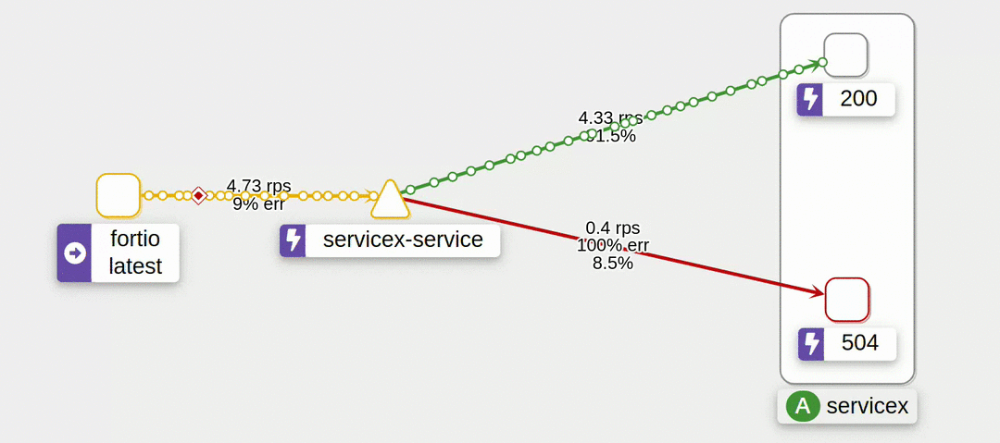
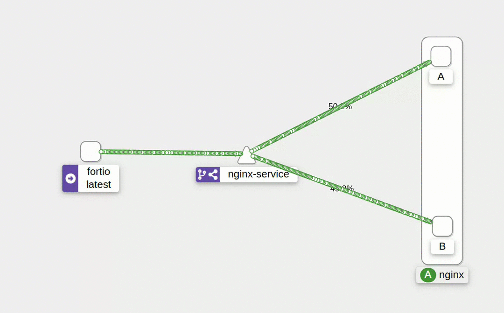
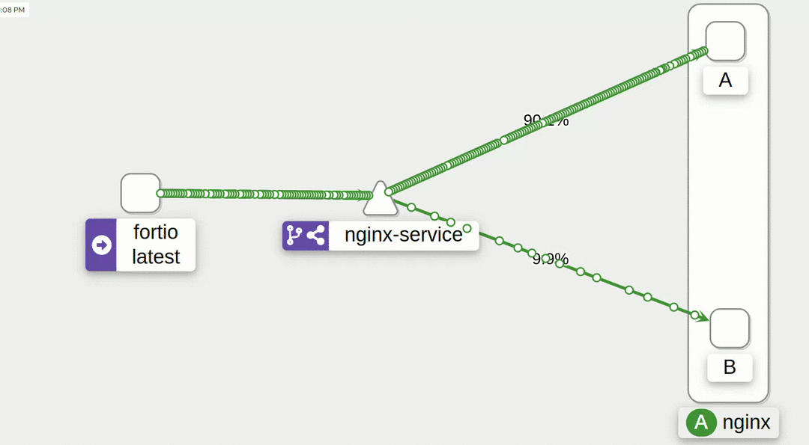

# Service Mesh [](https://wakatime.com/@diegosneves/projects/otoebwtaou)

### [Service Mesh com Istio](https://www.opus-software.com.br/insights/service-mesh-e-istio/)

[**Service Mesh:**](https://www.redhat.com/pt-br/topics/microservices/what-is-a-service-mesh)
Service Mesh (malha de serviço) é uma infraestrutura dedicada à comunicação, observabilidade e controle entre serviços em uma arquitetura de microsserviços. Ele fornece uma camada de controle que lida com funções como descoberta de serviço, balanceamento de carga, resiliência e segurança, permitindo que os desenvolvedores se concentrem mais na lógica de negócios do que nas preocupações operacionais relacionadas à comunicação entre serviços.

Principais características da Service Mesh:

1. **Descoberta de Serviço:** Automatiza a descoberta de serviços em um ambiente distribuído.

2. **Balanceamento de Carga:** Distribui o tráfego de maneira equitativa entre várias instâncias de um serviço.

3. **Resiliência:** Oferece mecanismos para tornar os sistemas mais resistentes a falhas, como retries, timeouts e circuit breakers.

4. **Monitoramento e Observabilidade:** Facilita a coleta de métricas, logs e traces para fornecer insights sobre o desempenho do sistema.

5. **Segurança:** Gerencia a comunicação segura entre os serviços e pode fornecer políticas de segurança, como autenticação e autorização.

6. **Roteamento Avançado:** Possibilita roteamento condicional e regras avançadas de tráfego.

[**Istio:**](https://istio.io/)
Istio é uma implementação popular de uma Service Mesh de código aberto. Ele foi projetado para gerenciar a comunicação entre serviços em um ambiente de microsserviços e oferece uma série de recursos avançados para controlar e monitorar o tráfego entre esses serviços.

Principais recursos do Istio:

1. **Injeção Lado do Cliente (Envoy Proxy):** O Istio utiliza o Envoy Proxy para interceptar todas as comunicações entre os serviços. Ele é automaticamente injetado nos pods dos contêineres.

2. **Balanceamento de Carga:** O Istio fornece balanceamento de carga e controle de tráfego, permitindo roteamento condicional e divisão de tráfego.

3. **Monitoramento:** Integra-se a ferramentas populares, como Prometheus e Grafana, para fornecer monitoramento detalhado do tráfego e métricas do sistema.

4. **Resiliência:** Oferece recursos como retries, timeouts e circuit breakers para tornar os sistemas mais resistentes a falhas.

5. **Segurança:** Implementa políticas de segurança, como autenticação mútua e autorização baseada em regras.

6. **Tracing:** Facilita a geração e visualização de traces para diagnóstico de problemas e análise de desempenho.

O uso de uma Service Mesh como o Istio pode simplificar muitos dos desafios associados à comunicação entre serviços em uma arquitetura de microsserviços, proporcionando maior visibilidade e controle sobre a rede de serviços. No entanto, também adiciona complexidade ao ambiente e geralmente é mais benéfico em ambientes de microsserviços mais complexos.

---

## [*K3D*](https://k3d.io/):


1) Comando para instalacao:

```shell
wget -q -O - https://raw.githubusercontent.com/k3d-io/k3d/main/install.sh | bash
```

---


- Criando o cluster com 2 nodes para você acessar os nodes através da porta 8000.

```shell
k3d cluster create -p "8000:30000@loadbalancer" --agents 2
```
*Saida da tela:*

```textmate
INFO[0000] portmapping '8000:30000' targets the loadbalancer: defaulting to [servers:*:proxy agents:*:proxy] 
INFO[0000] Prep: Network                                
INFO[0000] Created network 'k3d-k3s-default'            
INFO[0000] Created image volume k3d-k3s-default-images  
INFO[0000] Starting new tools node...                   
INFO[0001] Creating node 'k3d-k3s-default-server-0'     
INFO[0001] Pulling image 'ghcr.io/k3d-io/k3d-tools:5.6.0' 
INFO[0004] Starting Node 'k3d-k3s-default-tools'        
INFO[0004] Pulling image 'docker.io/rancher/k3s:v1.27.4-k3s1' 
INFO[0007] Creating node 'k3d-k3s-default-agent-0'      
INFO[0007] Creating node 'k3d-k3s-default-agent-1'      
INFO[0007] Creating LoadBalancer 'k3d-k3s-default-serverlb' 
INFO[0008] Pulling image 'ghcr.io/k3d-io/k3d-proxy:5.6.0' 
INFO[0019] Using the k3d-tools node to gather environment information 
INFO[0019] HostIP: using network gateway 172.20.0.1 address 
INFO[0019] Starting cluster 'k3s-default'               
INFO[0019] Starting servers...                          
INFO[0019] Starting Node 'k3d-k3s-default-server-0'     
INFO[0022] Starting agents...                           
INFO[0022] Starting Node 'k3d-k3s-default-agent-0'      
INFO[0022] Starting Node 'k3d-k3s-default-agent-1'      
INFO[0025] Starting helpers...                          
INFO[0025] Starting Node 'k3d-k3s-default-serverlb'     
INFO[0031] Injecting records for hostAliases (incl. host.k3d.internal) and for 4 network members into CoreDNS configmap... 
INFO[0033] Cluster 'k3s-default' created successfully!  
INFO[0033] You can now use it like this:                
kubectl cluster-info
```


- Verificando os nodes criados.

```shell
kubectl get nodes
```

*Saída da tela:*
```textmate
NAME                       STATUS   ROLES                  AGE     VERSION
k3d-k3s-default-server-0   Ready    control-plane,master   8m32s   v1.27.4+k3s1
k3d-k3s-default-agent-0    Ready    <none>                 8m30s   v1.27.4+k3s1
k3d-k3s-default-agent-1    Ready    <none>                 8m30s   v1.27.4+k3s1
```

---

## [Istio](https://istio.io/):

[Documentacao](https://istio.io/latest/docs/)


### instalação:

- Download:

  ```shell
  curl -L https://istio.io/downloadIstio | sh -
  ```

- Adicione o cliente istioctl ao seu caminho (Linux):

  ```shell
  export PATH=$PATH:~/istio-1.20.0/bin
  ```

  ```shell
  source ~/.bashrc
  ```

- Após escolher o [perfil](https://istio.io/latest/docs/setup/getting-started/#install)(ou deixe em branco para _default_) execute o comando para instalação:

  ```shell
  istioctl install -y
  ```
  - Exemplo de perfil `demo`:

    ```textmate
    istioctl install --set profile=demo -y
    ✔ Istio core installed
    ✔ Istiod installed
    ✔ Egress gateways installed
    ✔ Ingress gateways installed
    ✔ Installation complete
    ```

  
  
- Validar instalação pelo terminal:

  ```shell
  kubectl get ns
  ```

    Ao usar o comando acima deve aparecer na lista o `istio-system` conforme exemplo abaixo:

    ```textmate
    NAME              STATUS   AGE
    default           Active   4h51m
    kube-system       Active   4h51m
    kube-public       Active   4h51m
    kube-node-lease   Active   4h51m
    istio-system      Active   66m
    ```
    
    
  - Utilize o seguinte comando:

    ```shell
    kubectl get pod -n istio-system
    ```

    ```textmate
    NAME                                    READY   STATUS    RESTARTS   AGE
    istiod-7d4885fc54-rrhgq                 1/1     Running   0          69m
    istio-ingressgateway-56558c9fd7-hbhxk   1/1     Running   0          69m
    ```


- Seus pods serão exibidos na tela. 

- Outras validações:

  ```shell
  kubectl get svc
  ```

  deve ser exibido dados do service conforme exemplo abaixo:

  ```textmate
  NAME         TYPE        CLUSTER-IP   EXTERNAL-IP   PORT(S)   AGE
  kubernetes   ClusterIP   10.43.0.1    <none>        443/TCP   4h59m
  ```

  ```shell
  kubectl get svc -n istio-system
  ```
  
  ```textmate
  NAME                   TYPE           CLUSTER-IP      EXTERNAL-IP   PORT(S)                                      AGE
  istiod                 ClusterIP      10.43.33.239    <none>        15010/TCP,15012/TCP,443/TCP,15014/TCP        78m
  istio-ingressgateway   LoadBalancer   10.43.236.123   <pending>     15021:32400/TCP,80:30279/TCP,443:31788/TCP   78m
  ```

---

## Docker
Vamor criar uma imagem Nginx para utlizar nesse projeto:

### NGINX:
As imagens Nginx para esse projeto terão apenas diferencas no `body` do html.

- index.html
  ```html
  <!DOCTYPE html>
  <html lang="en">
  <head>
    <meta charset="UTF-8">
    <meta name="viewport" content="width=device-width, initial-scale=1.0">
    <title>Minha Página</title>
  </head>
  <body>
    <h1>Diego A</h1>
  </body>
  </html>
  ```
  > _Exemplo:_ Acima um `html` classico, mas para fins didáticos iremos abordar o exemplo abaixo
  
    ```html
    Diego A
    ```

  esse `html` iremos alterar para que um dos valores seja `Diego A` e o outro `Diego B`. Isso servirá para realizar alguns testes.
- Dockerfile
  ```yaml
  # Use a imagem Nginx
  FROM nginx:latest
  LABEL authors="diegoneves"
  
  # Copie o arquivo index.html para o diretório padrão do Nginx
  COPY index.html /usr/share/nginx/html/index.html
  
  # Exponha a porta 80
  EXPOSE 80
  ```
#### Vamos criar duas versões:

- Faca o login:
  ```shell
  docker login
  ```
- build:
  > Altere os valores necessarios `docker build -t seu-usuario-dockerhub/nome-imagem:tag .`
  ```shell
  docker build -t diegoneves/nginx-sn:latest .
  ```
  Após buildar, faca o `push` para o [DockerHub](https://hub.docker.com/) utilizando o seguinte comando:
  ```shell
  docker push diegoneves/nginx-sn:latest
  ```
Agora altere o valor do `Diego A` no index para `Diego B` e repita o processo alterando a tag `latest` para `b`.


---

## Sidecar Proxy

- Adicione um rótulo de namespace para instruir o Istio a injetar automaticamente proxies secundários quando você implantar seu aplicativo posteriormente:

  ```shell
  kubectl label namespace default istio-injection=enabled
  ```

- Crie um `deployment` conforme exemplo abaixo:
```yaml
apiVersion: apps/v1
kind: Deployment
metadata:
  name: nginx
  labels:
    app: nginx
spec:
#  replicas: 1
  selector:
    matchLabels:
      app: nginx
  template:
    metadata:
      name: nginx
      labels:
        app: nginx
    spec:
      containers:
        - name: nginx
          image: diegoneves/nginx-sn:latest
          resources:
            limits:
              memory: "128Mi"
              cpu: "500m"
          ports:
            - containerPort: 80
```

- Aplique o `deployment`:
  ```shell
  kubectl apply -f src/github/k8s/deployment.yaml 
  ```

- Veja a saida com o comando abaixo:
  ```shell
  kubectl get pod
  ```

---

## Configurando Addons:

- [Istio Integration](https://istio.io/latest/docs/ops/integrations/) possi tambem infos para configurar o [cert-manager](https://istio.io/latest/docs/ops/integrations/certmanager/)

- Para adicionar alguns addons para telemetria, basta encontrar na propria [doc do Istio](https://istio.io/latest/docs/setup/getting-started/#dashboard) o link para [Istio Integration](https://istio.io/latest/docs/ops/integrations/).
  - [Kiali](https://istio.io/latest/docs/ops/integrations/kiali/)
  ```shell
  kubectl apply -f https://raw.githubusercontent.com/istio/istio/release-1.20/samples/addons/kiali.yaml
  ```
  - [Grafana](https://istio.io/latest/docs/ops/integrations/grafana/)
  ```shell
  kubectl apply -f https://raw.githubusercontent.com/istio/istio/release-1.20/samples/addons/grafana.yaml
  ```
  - [Prometheus](https://istio.io/latest/docs/ops/integrations/prometheus/)
  ```shell
  kubectl apply -f https://raw.githubusercontent.com/istio/istio/release-1.20/samples/addons/prometheus.yaml
  ```
  - [Jaeger](https://istio.io/latest/docs/ops/integrations/jaeger/)
  ```shell
  kubectl apply -f https://raw.githubusercontent.com/istio/istio/release-1.20/samples/addons/jaeger.yaml
  ```
para o exemplo desse projeto foi utilizado esses quatros addons.

```shell
kubectl get pod -n istio-system
```

```textmate
NAME                                    READY   STATUS    RESTARTS        AGE
istiod-7d4885fc54-rrhgq                 1/1     Running   1 (7h34m ago)   19h
istio-ingressgateway-56558c9fd7-hbhxk   1/1     Running   1 (7h34m ago)   19h
kiali-cc67f8648-wbp8k                   1/1     Running   0               16m
grafana-5f9b8c6c5d-dqxcn                1/1     Running   0               16m
prometheus-5d5d6d6fc-txhrm              2/2     Running   0               15m
jaeger-db6bdfcb4-jjrbn                  1/1     Running   0               15m
```

```shell
kubectl get svc -n istio-system
```

```text
NAME                   TYPE           CLUSTER-IP      EXTERNAL-IP   PORT(S)                                          AGE
istiod                 ClusterIP      10.43.33.239    <none>        15010/TCP,15012/TCP,443/TCP,15014/TCP            19h
istio-ingressgateway   LoadBalancer   10.43.236.123   <pending>     15021:32400/TCP,80:30279/TCP,443:31788/TCP       19h
kiali                  ClusterIP      10.43.91.134    <none>        20001/TCP,9090/TCP                               100s
grafana                ClusterIP      10.43.9.55      <none>        3000/TCP                                         76s
prometheus             ClusterIP      10.43.139.253   <none>        9090/TCP                                         53s
tracing                ClusterIP      10.43.62.51     <none>        80/TCP,16685/TCP                                 37s
zipkin                 ClusterIP      10.43.7.76      <none>        9411/TCP                                         37s
jaeger-collector       ClusterIP      10.43.65.194    <none>        14268/TCP,14250/TCP,9411/TCP,4317/TCP,4318/TCP   37s
```

---

## Obervabilidade:

### - [Kiali](https://istio.io/latest/docs/tasks/observability/kiali/):

- Para abrir a interface do Kiali, execute o seguinte comando em seu ambiente Kubernetes:
  ```shell
  istioctl dashboard kiali
  ```


---

## Gerenciamento de tráfico (_[doc](https://istio.io/latest/docs/concepts/traffic-management/)_):

comando para auxiliar nas requests:

```shell
while true;do curl http://localhost:8000; echo; sleep 0.5; done;
```
Depois basta abrir o [Kiali](#--kiali) e verificar o trafico.

### [Fortio](https://istio.io/latest/docs/tasks/traffic-management/circuit-breaking/#adding-a-client):
```shell
kubectl apply -f https://raw.githubusercontent.com/istio/istio/release-1.20/samples/httpbin/sample-client/fortio-deploy.yaml
```

Comando para teste de stress:

```shell
kubectl exec fortio-deploy-5669d4866b-76wss -c fortio -- fortio load -c 2 -qps 0 -t 200s -loglevel Warning http://nginx-service:8000
```

> Para facilitar é possivel pegar o nome do pod do fortio para atraves de um export:
> 
>```shell
>export FORTIO_POD=$(kubectl get pods -l app=fortio -o 'jsonpath={.items[0].metadata.name}')
>```
>isso evita ter que usar algo tipo `fortio-deploy-5669d4866b-76wss` para executar o comando.
>```shell
>kubectl exec "$FORTIO_POD" -c fortio -- fortio load -c 2 -qps 0 -t 200s -loglevel Warning http://nginx-service:8000
>```

---

## Consistent Hash:

Na config abaixo definimos que o `trafficPolicy` tera seu `loadBalancer` como um `consistentHash` para 'guardar' o header name(`httpHeaderName : "x-user"`).
Isso enviara o usuario sempre para o mesmo pod.

exemplo:
```yaml
apiVersion: networking.istio.io/v1alpha3
kind: VirtualService
metadata:
  name: nginx-vs
  labels:
    app: nginx-vs
spec:
  hosts:
    - nginx-service
  http:
    - route:
        - destination:
            host: nginx-service
            subset: all

---

apiVersion: networking.istio.io/v1alpha3
kind: DestinationRule
metadata:
  name: nginx-dr
  labels:
    app: nginx-dr
spec:
  host: nginx-service
  trafficPolicy:
    loadBalancer:
      consistentHash:
        httpHeaderName: "x-user" # Esse 'x-user' pode ser qualquer valor;
  subsets:
    - name: all
      labels:
        app: nginx
```
Após aplicar `kubectl apply -f consistent-hash.yaml` já é possivel testar.

Utilize o comando abaixo para conseguir o `NAME` de um `POD` Nginx.
```shell
kubectl get po
```

Acesse o terminal do `POD` selecionado conforme exemplo abaixo:
```shell
kubectl exec -it nginx-b-675b854866-45j42 -- bash
```

Dentro do `POD` execute o comando abaixo varias vezes para verificar que a chamada altera entre os services Nginx.
```shell
curl http://nginx-service:8000 ; echo
```
```textmate
root@nginx-b-675b854866-45j42:/# curl http://nginx-service:8000 ; echo
Diego B

root@nginx-b-675b854866-45j42:/# curl http://nginx-service:8000 ; echo
Diego A
```

Agora, ao utilizar o comando conforme exemplo abaixo a chamada devera ser direcionada sempre ao mesmo service Nginx.
```shell
curl --header "x-user: diego" http://nginx-service:8000 ; echo
```
```textmate
root@nginx-b-675b854866-45j42:/# curl --header "x-user: diego" http://nginx-service:8000 ; echo
Diego B

root@nginx-b-675b854866-45j42:/# curl --header "x-user: diego" http://nginx-service:8000 ; echo
Diego B
```
- Outro usuario:
```textmate
root@nginx-b-675b854866-45j42:/# curl --header "x-user: aline" http://nginx-service:8000 ; echo
Diego A

root@nginx-b-675b854866-45j42:/# curl --header "x-user: aline" http://nginx-service:8000 ; echo
Diego A
```

---

## Fault Injection:

O **Istio** fornece recursos avançados para gerenciar o tráfego entre serviços em um ambiente de malha de serviço. 
A injeção de falhas é uma técnica importante no gerenciamento de resiliência, permitindo que você simule condições de falha para testar como seu sistema reage em 
situações adversas. O Istio facilita a injeção de falhas com seu recurso de "Fault Injection" (Injeção de Falhas).

Alguns dos principais aspectos da injeção de falhas no Istio incluem:

- **Delay (Atraso)**: Você pode introduzir atrasos na comunicação entre serviços para simular latência de rede ou outros atrasos. 
Isso ajuda a testar a resiliência do seu sistema em condições de rede menos ideais.

- **Abort (Abortar)**: A injeção de falhas também permite que você simule falhas em uma solicitação, abortando a conexão entre serviços antes que a solicitação seja concluída. 
Isso pode ser usado para simular falhas de serviço e verificar como o seu sistema se recupera.

- **Retries (Retentativas)**: Você pode configurar políticas de retentativa que especificam se uma solicitação deve ser automaticamente retentada após uma falha.

- **Circuit Breaking (Quebra de Circuito):** O Istio oferece controle sobre o circuit breaking, permitindo que você limite a quantidade de tráfego que um 
serviço pode receber se ele estiver com falha.

Para realizar a injeção de falhas com Istio, você normalmente usa o recurso de VirtualService para definir regras de tráfego e o 
recurso de Fault Injection dentro do VirtualService para introduzir as condições de falha desejadas.

- Exemplo com **_Delay_**:
```yaml
apiVersion: networking.istio.io/v1alpha3
kind: VirtualService
metadata:
  name: nginx-vs
  labels:
    app: nginx-vs
spec:
  hosts:
    - nginx-service
  http:
    - fault:
        delay:
          fixedDelay: 10s
          percentage:
            value: 25
      route:
        - destination:
            host: nginx-service
            subset: all
```
- Exemplo com **_Abort_**:

```yaml
apiVersion: networking.istio.io/v1alpha3
kind: VirtualService
metadata:
  name: nginx-vs
  labels:
    app: nginx-vs
spec:
  hosts:
    - nginx-service
  http:
    - fault:
        abort:
          httpStatus: 503
          percentage:
            value: 25
      route:
        - destination:
            host: nginx-service
            subset: all
```

---

## Circuit Break:


O Circuit Breaking, ou quebra de circuito, é uma técnica de gerenciamento de resiliência que visa evitar falhas catastróficas em sistemas distribuídos. O Istio oferece suporte ao Circuit Breaking como parte de suas funcionalidades avançadas de gerenciamento de tráfego na malha de serviço.

A quebra de circuito no Istio funciona de maneira semelhante a um disjuntor elétrico. Se uma quantidade excessiva de solicitações para um serviço falhar ou levar muito tempo para ser processada, o Istio pode abrir o "circuito" para esse serviço, impedindo temporariamente que mais solicitações cheguem até ele. Isso evita que o serviço seja sobrecarregado e permite que ele se recupere.

Alguns dos principais conceitos relacionados ao Circuit Breaking no Istio incluem:

- **Thresholds (Limites)**: Você pode configurar limiares para métricas como taxa de erro e latência. Se esses limiares forem ultrapassados, o circuito é aberto.

- **Sleep Windows (Janelas de Suspensão)**: Depois que o circuito é aberto, um "período de suspensão" é ativado, durante o qual todas as solicitações são automaticamente rejeitadas. Isso dá ao serviço tempo para se recuperar.

- **Max Connections (Conexões Máximas)**: O Istio permite que você configure o número máximo de conexões simultâneas que um serviço pode aceitar antes de abrir o circuito.

- **HTTP Delay (Atraso HTTP)**: Além de abrir o circuito, o Istio pode introduzir um atraso adicional nas respostas HTTP para simular um comportamento degradado.

O recurso DestinationRule no Istio é usado para definir políticas de destino para o tráfego que é roteado para um serviço específico.

```yaml
  trafficPolicy:
    outlierDetection:
      consecutiveGatewayErrors: 10 # Essa config se aplica apenas ao erros 502, 503 e 504.
      interval: 5s
      baseEjectionTime: 30s
      maxEjectionPercent: 100
```

Vamos explicar cada uma dessas configurações:

- **consecutiveGatewayErrors**: Esse campo configura o número de erros consecutivos que podem ocorrer antes que um host (instância do serviço) seja marcado como atípico. No exemplo, se houver 10 erros consecutivos (502, 503 ou 504), o Istio considerará essa instância do serviço como atípica.

- **interval**: Este é o intervalo de tempo durante o qual o Istio contará os erros consecutivos. No exemplo, a contagem é redefinida a cada 5 segundos.

- **baseEjectionTime**: Este campo configura o tempo mínimo que um host atípico será removido antes de ser considerado para reentrada no pool. No exemplo, um host será removido por no mínimo 30 segundos.

- **maxEjectionPercent**: Este campo configura a porcentagem máxima de hosts que podem ser removidos do pool devido a serem considerados atípicos. No exemplo, 100% dos hosts podem ser removidos.

Essas configurações são usadas para melhorar a resiliência do seu sistema em face de instâncias de serviço que estão se comportando mal. 
Se um número significativo de erros consecutivos é detectado em uma instância de serviço dentro do intervalo especificado, 
essa instância pode ser temporariamente removida do pool, permitindo que o sistema se recupere e evite a degradação adicional devido a 
instâncias de serviço com falha.

### Testes:

```shell
kubectl exec fortio-deploy-5669d4866b-76wss -c fortio -- fortio load -c 2 -qps 0 -n 200 -loglevel Warning http://servicex-service
```

#### Kiali:


- Ao identificar a falha,  mais de 97% das requisicoes foram direcionadas para o outro workload.
```textmate
IP addresses distribution:
10.43.43.62:80: 18
Code  -1 : 5 (2.5 %)
Code 200 : 195 (97.5 %)
Response Header Sizes : count 200 avg 154.075 +/- 24.67 min 0 max 161 sum 30815
Response Body/Total Sizes : count 200 avg 165.775 +/- 26.55 min 0 max 173 sum 33155
All done 200 calls (plus 0 warmup) 251.379 ms avg, 8.0 qps
```

---

## [Gateway](src/github/k8s/gateway.yaml):

O recurso Gateway no Istio é usado para configurar o tráfego de entrada para a malha de serviço. 
Ele define como o tráfego externo é roteado para os serviços internos do cluster Kubernetes.

Aqui está uma explicação das partes-chave da configuração:

```yaml
apiVersion: networking.istio.io/v1alpha3
kind: Gateway
metadata:
  name: ingress-gateway-config
  labels:
    app: ingress-gateway-config
spec:
  selector:
    istio: ingressgateway
  servers:
    - port:
        number: 80
        name: http
        protocol: http2
      hosts:
        - "*"
```

- **name**: O nome do seu Gateway.

- **selector**: O seletor que especifica os gateways que devem implementar essa configuração. 
Neste caso, ele usa o valor padrão para o ingress gateway do Istio.

- **servers**: Configuração para os servidores (portas) que o gateway deve escutar. Nesse caso, há apenas uma configuração para a porta 80.

  - **port**: Configuração da porta.

    - **number**: O número da porta (80 para HTTP neste caso).

    - **name**: Nome da porta.

    - **protocol**: Protocolo usado na porta (HTTP2 neste caso).

  >_O **HTTP/2** é uma versão aprimorada do protocolo **HTTP**, que é amplamente utilizado para a comunicação entre clientes (geralmente navegadores da web) e servidores na Internet.
  > O suporte ao **HTTP/2** é amplamente adotado em navegadores modernos e servidores da web. 
  > Ele oferece melhor desempenho e eficiência em comparação com o **HTTP/1.x**, especialmente em cenários nos quais a latência da rede é um fator significativo._

- **hosts**: Lista de hosts para os quais esse servidor deve responder. No seu exemplo, "\*" significa que este gateway vai responder para qualquer host. 
Você pode substituir "\*" pelo domínio específico que você deseja, como "meu-site.com.br".

Esta configuração basicamente diz ao Istio para encaminhar o tráfego HTTP na porta 80 para os serviços internos da malha de serviço que correspondem ao host especificado. 
Certifique-se de ajustar o host de acordo com o domínio real que você deseja associar ao gateway.

Além disso, para que essa configuração funcione corretamente, você precisará de um **VirtualService** que especifique como o tráfego deve ser roteado. 
O **VirtualService** geralmente é vinculado ao Gateway. Certifique-se de criar ou ajustar o **VirtualService** conforme necessário para suas necessidades.

---

### Configuracao de peso:

#### Peso - 50% por 50%:

```yaml
http:
   - route:
       - destination:
           host: nginx-service
           subset: v1
         weight: 50
       - destination:
           host: nginx-service
           subset: v2
         weight: 50
```


#### Peso - 90% por 10%:

```yaml
http:
   - route:
       - destination:
           host: nginx-service
           subset: v1
         weight: 90
       - destination:
           host: nginx-service
           subset: v2
         weight: 10
```

---

### Configuracao Local:

Para realizar os testes, foi necessario alterar a porta configurada no `istio-ingressgateway` para que o proxy do istio seja acessado, garantindo assim as configs criadas.

para alterar a porta `30279`.
```textmate
NAME                   TYPE           CLUSTER-IP      EXTERNAL-IP   PORT(S)                                          AGE
istio-ingressgateway   LoadBalancer   10.43.236.123   <pending>     15021:32400/TCP,80:30279/TCP,443:31788/TCP       4d21h
```
Foi utilizado o seguinte comando:

```shell
kubectl edit svc istio-ingressgateway -n istio-system
```
```textmate
NAME                   TYPE           CLUSTER-IP      EXTERNAL-IP   PORT(S)                                          AGE
istio-ingressgateway   LoadBalancer   10.43.236.123   <pending>     15021:32400/TCP,80:30000/TCP,443:31788/TCP       4d22h
```

---

## Trabalhando com prefixos:

No **Istio**, o recurso `VirtualService` é usado para definir como o tráfego deve ser roteado para diferentes versões ou `subsets` de um serviço. 
Nesse exemplo, usamos o campo **`uri`** com a opção **prefix** para definir diferentes rotas baseadas em prefixos.

Vamos analisar a configuração:

```yaml
apiVersion: networking.istio.io/v1alpha3
kind: VirtualService
metadata:
  name: nginx-vs
  labels:
    app: nginx-vs
spec:
  hosts:
    - "*"
  gateways:
    - ingress-gateway-config
  http:
    - match:
        - uri:
            prefix: "/b"
        - route:
            - destination:
                host: nginx-service
                subset: v2
    - match:
        - uri:
            prefix: "/"
        - route:
            - destination:
                host: nginx-service
                subset: v1

    - route:
        - destination:
            host: nginx-service
            subset: v1
          weight: 50
        - destination:
            host: nginx-service
            subset: v2
          weight: 50
```

- **hosts: [`"*"`]**: Este `VirtualService` se aplica a todos os hosts.

- **gateways: [`ingress-gateway-config`]**: Este `VirtualService` está vinculado ao Gateway chamado `ingress-gateway-config`.

- Rotas baseadas em Prefixo:

  - **uri**: **prefix: `"/b"`**: Esta regra aplica-se a solicitações cujo caminho começa com `"/b"`. 
Se um pedido corresponder a isso, ele será roteado para a versão `v2` do serviço `nginx-service`.

  - **uri: prefix: `"/"`**: Esta regra aplica-se a solicitações cujo caminho é qualquer coisa que não comece com `"/b"`. 
Se um pedido corresponder a isso, ele será roteado para a versão `v1` do serviço `nginx-service`.

- **route:**: Esta é a parte onde as rotas são definidas. As rotas são selecionadas com base nas correspondências acima.

  - Para o prefixo `"/b"`, a solicitação será roteada para a versão `v2` do serviço `nginx-service`.

  - Para qualquer outro prefixo (ou nenhum prefixo), a solicitação será roteada para a versão `v1` do serviço `nginx-service`.

  - A última seção define um balanceamento de carga ponderado de `50%` para cada versão (`v1` e `v2`).

Este exemplo ilustra como usar prefixos no campo `uri` para criar rotas diferentes com base nos caminhos das solicitações. 
Certifique-se de ajustar conforme necessário com base nos requisitos específicos do seu aplicativo.

---